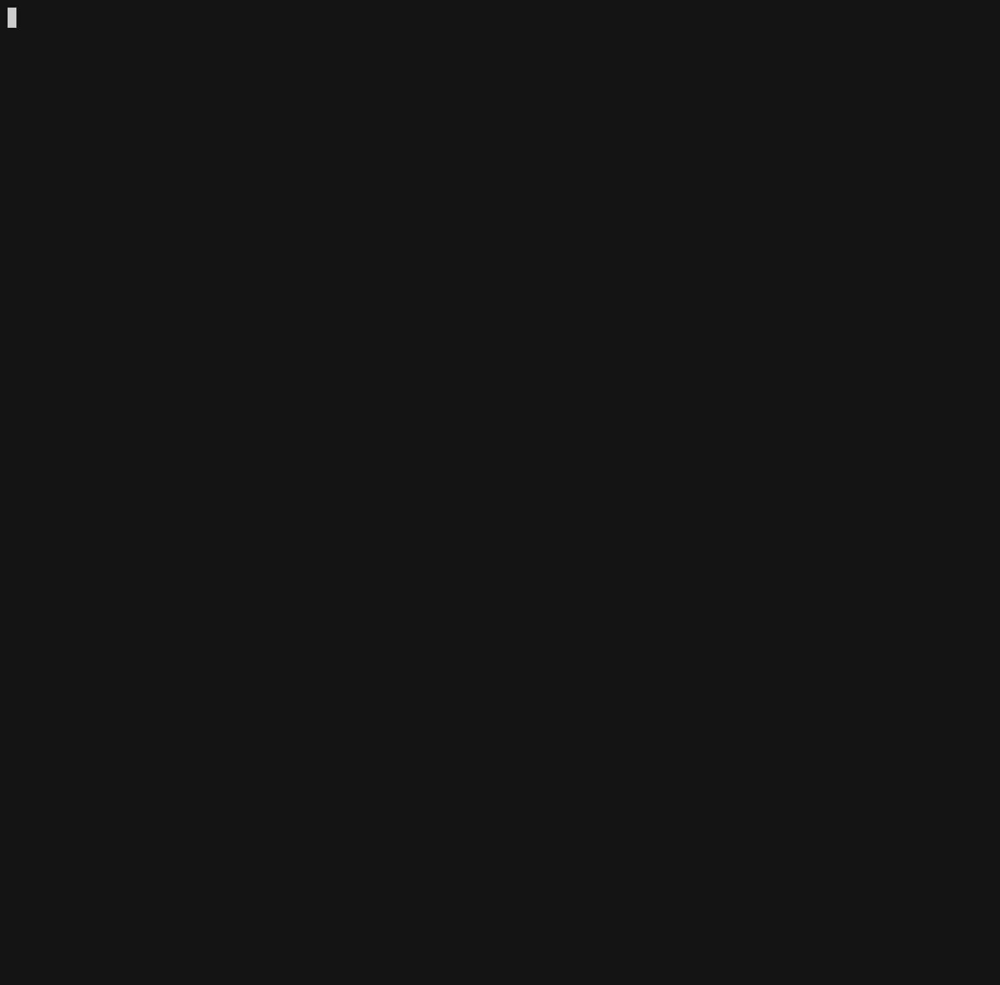

# HinD - Hashistack-in-Docker
```diff
+       ___                                              ·
+      /\  \                      ___                    ·
+      \ \--\       ___          /\  \        __ __      ·
+       \ \--\     /\__\         \ \--\     / __ \__\    ·
+   ___ /  \--\   / /__/     _____\ \--\   / /__\ \__\   ·
+  /\_ / /\ \__\ /  \ _\    / ______ \__\ / /__/ \ |__|  ·
+  \ \/ /_ \/__/ \/\ \ _\__ \ \__\  \/__/ \ \__\ / /__/  ·
+   \  /__/         \ \/\__\ \ \__\        \ \__/ /__/   ·
+    \ \ _\          \  /_ /  \ \__\        \ \/ /__/    ·
+     \ \__\         / /_ /    \/__/         \  /__/     ·
+      \/__/         \/__/                    \/__/      ·
+                                                        ·
```




Installs `nomad`, `consul`, and `caddyserver` (router) together as a mini cluster running inside a `docker` container.

Nomad jobs will run as `docker` containers on the VM itself, orchestrated by `nomad`, leveraging `docker.sock`.

The _brilliant_ `consul-template` will be used as "glue" between `consul` and `caddyserver` -- turning `caddyserver` into an always up-to-date reverse proxy router from incoming requests' Server Name Indication (SNI) to running containers :)

## Minimal requirements:
- VM you can `ssh` into
- VM with `docker` daemon
- if using a firewall (like `ferm`, etc.) make sure the following ports are open from the VM to the world:
  - 443  - https
  - 80   - http  (load balancer will auto-upgrade/redir to https)

## https
The ideal experience is that you point a dns wildcard at the IP address of the VM running your `hind` system.

This allows automatically-created hostnames from CI/CD pipelines [deploy] stage to use the [git group/organization + repository name + branch name] to create a nice semantic DNS hostname for your webapps to run as and load from - and everything will "just work".

For example, `*.example.com` DNS wildcard pointing to the VM where `hind` is running, will allow https://myteam-my-repo-name-my-branch.example.com to "just work".

We use [caddy](https://caddyserver.com) (which incorporates `zerossl` and Let's Encrypt) to on-demand create single host https certs as service discovery from `consul` announces new hostnames.


## Setup and run
This will "bootstrap" your cluster with a private, unique NOMAD_TOKEN,
and `docker run` a new container with the hind service into the background.

```bash
docker run --net=host -v /var/run/docker.sock:/var/run/docker.sock \
  -e HOST_HOSTNAME=$(hostname) -e HOST_UNAME=$(uname) \
  --rm --name hind ghcr.io/internetarchive/hind:main
```

### build locally - if desired (not required)
This is our [Dockerfile](Dockerfile)

```bash
git clone https://github.com/internetarchive/hind.git
cd hind
docker build --network=host -t ghcr.io/internetarchive/hind:main .
```


## Setting up jobs
We suggest you use the same approach mentioned in
[nomad repo README.md](https://gitlab.com/internetarchive/nomad/-/blob/master/README.md)
which will ultimately use a templated
[project.nomad](https://gitlab.com/internetarchive/nomad/-/blob/master/project.nomad) file.
However, since we are running `nomad` and `consul` inside a docker container,
you will need to add the following to your
project's `.github/workflows/` (github) files
```yaml
        with:
          NOMAD_VAR_NETWORK_MODE: 'host'
          NOMAD_VAR_PORTS: '{ -1 = "http" }'
```
or `.gitlab-ci.yml` (gitlab) files:
```yaml
variables:
  NOMAD_VAR_NETWORK_MODE: 'host'
  NOMAD_VAR_PORTS: '{ -1 = "http" }'
```
This will make your container's main http port be dynamic (and not fixed to something like 80 or 5000) so that multiple deployments can all run using different ports.

Simply setup your project's `Dockerfile` to read the environment variable `$NOMAD_PORT_http` and have your webserver/daemon listen on that port.  `$NOMAD_PORT_http` gets set by `nomad` when your container starts up, to the random port it picked for your daemon to listen on.

## Nomad credentils
Get your nomad access credentials so you can run `nomad status` anywhere
that you have downloaded `nomad` binary (include home mac/laptop etc.)

From a shell on your VM:
```bash
eval $(docker run --rm hind cat /etc/hind)
env |egrep ^NOMAD_
```
Then, `nomad status` should work.
([Download `nomad` binary](https://www.nomadproject.io/downloads) to VM or home dir if/as needed).

You can also open the `NOMAD_ADDR` (above) in a browser and enter in your `NOMAD_TOKEN`

You can try a trivial website job spec from the cloned repo:
```bash
# you can manually set NOMAD_VAR_BASE_DOMAIN to your wildcard DNS domain name if different from
# the domain of your NOMAD_ADDR
export NOMAD_VAR_BASE_DOMAIN=$(echo "$NOMAD_ADDR" |cut -f2- -d.)
nomad run https://raw.githubusercontent.com/internetarchive/hind/main/etc/hello-world.hcl
```

## GUI, Monitoring, Interacting
- see [nomad repo README.md](https://gitlab.com/internetarchive/nomad/-/blob/master/README.md) for lots of ways to work with your deploys.  There you can find details on how to check a deploy's status and logs, `ssh` into it, customized deploys, and more.
- You can setup an `ssh` tunnel thru your VM so that you can see `consul` in a browser, eg:

```bash
nom-tunnel () {
  [ "$NOMAD_ADDR" = "" ] && echo "Please set NOMAD_ADDR environment variable first" && return
  local HOST=$(echo "$NOMAD_ADDR" |sed 's/^https*:\/\///')
  ssh -fNA -L 8500:localhost:8500 $HOST
}
```

- Then run `nom-tunnel` and you can see with a browser:
  - `consul` http://localhost:8500/


## Inspiration
Docker-in-Docker (dind) and `kind`:
- https://kind.sigs.k8s.io/

for `caddyserver` + `consul-connect`:
- https://blog.tjll.net/too-simple-to-fail-nomad-caddy-wireguard/


## Problems?
- If the main `docker run` is not completing, check your `docker` version to see how recent it is.  The `nomad` binary inside the setup container can segfault due to a perms change.  You can either _upgrade your docker version_ or try adding this `docker run` option:
```sh
docker run --security-opt seccomp=unconfined ...
```
